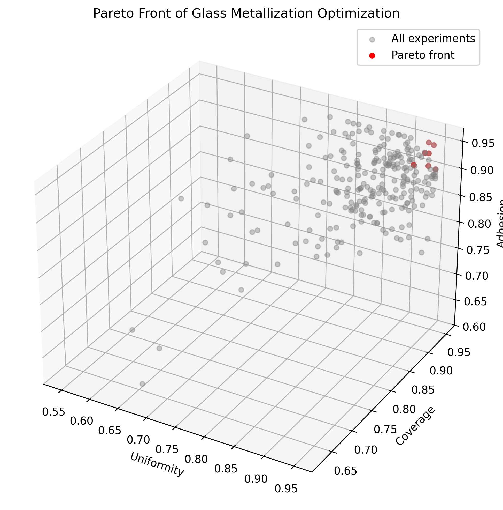
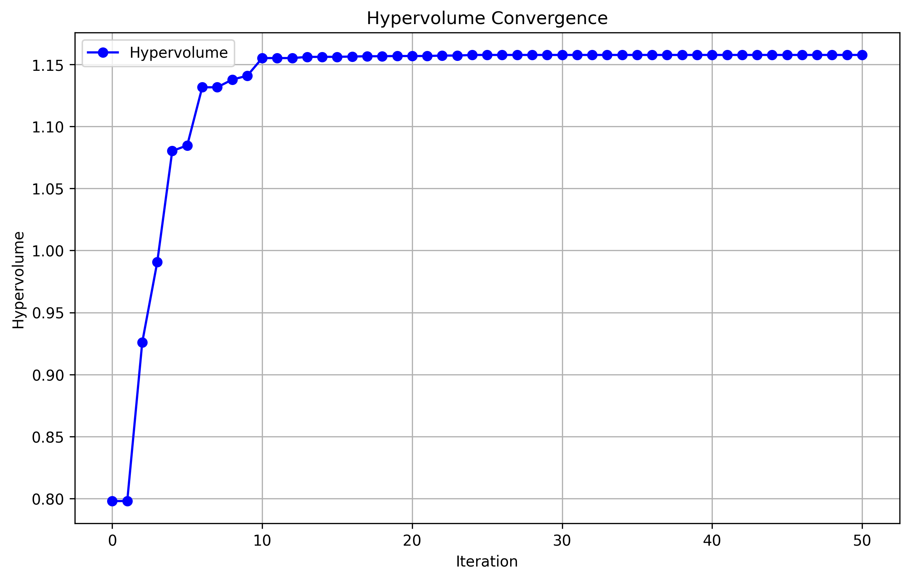
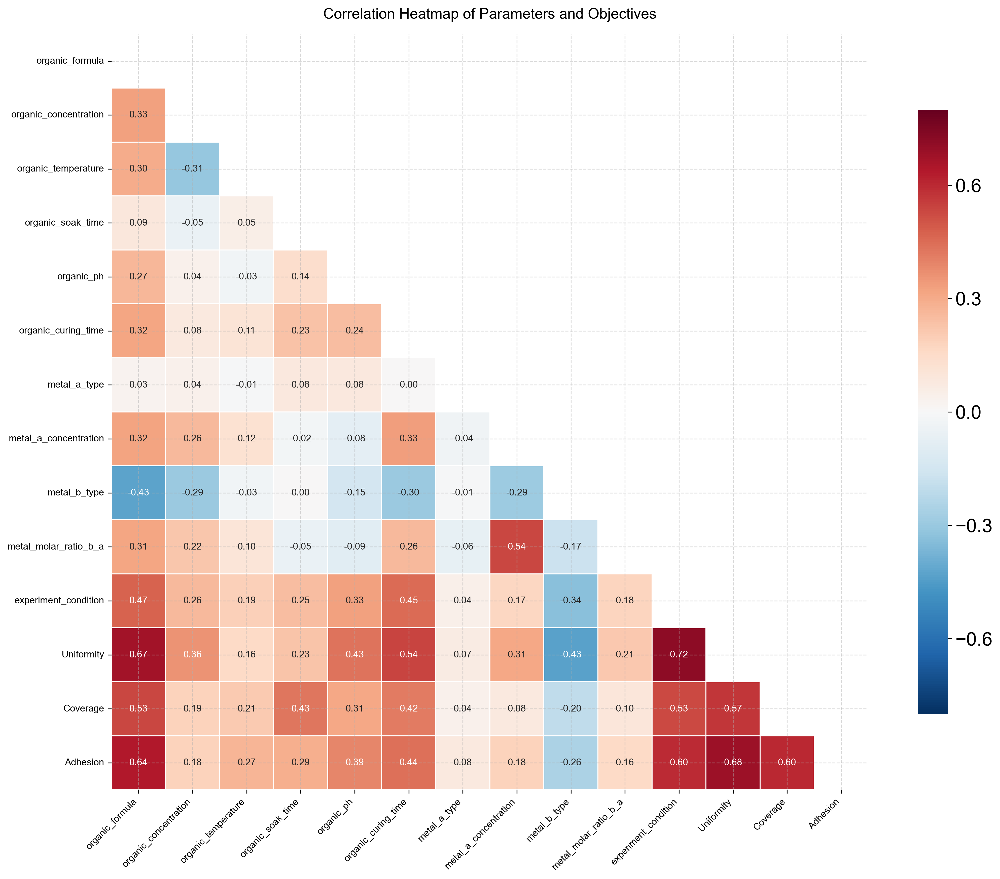
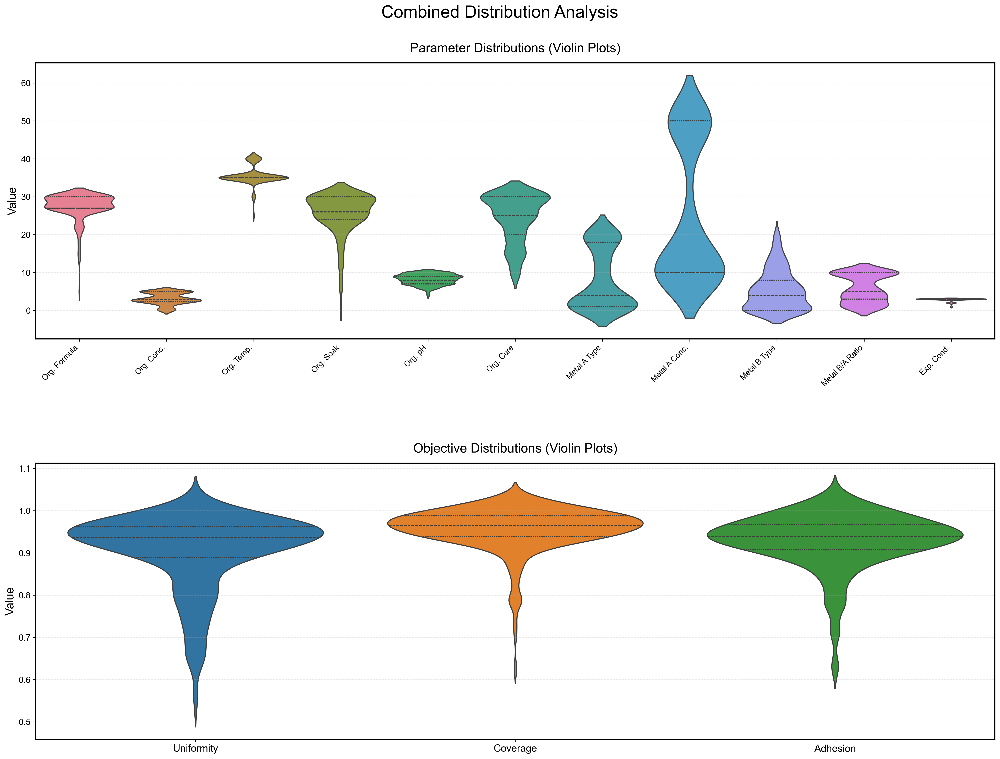
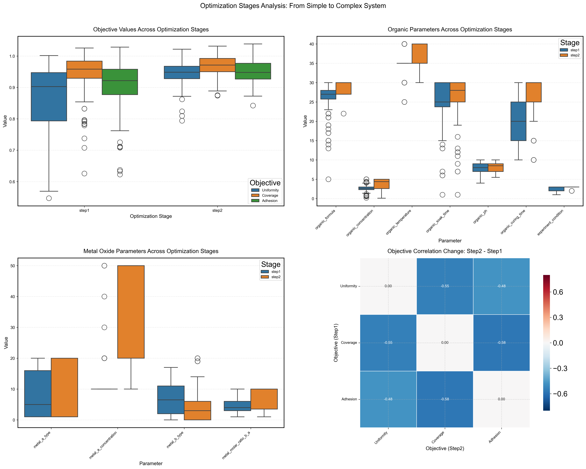

# Trace-Aware Knowledge Gradient (taKG) Multi-fidelity Bayesian Optimization

## 中文版本

### 项目概述

这是一个基于迹感知知识梯度（Trace-Aware Knowledge Gradient, taKG）的多目标贝叶斯优化框架，专门设计用于玻璃金属化过程的优化。该框架能够同时优化三个关键目标：均匀性（Uniformity）、覆盖率（Coverage）和附着力（Adhesion）。

### 功能特性

- **迹感知知识梯度（taKG）算法**：结合了模型性能轨迹和超体积改进的先进获取函数
- **多目标优化**：同时优化三个相互冲突的目标，生成帕累托前沿
- **两阶段优化策略**：先探索简单系统，再过渡到复杂系统
- **安全性约束**：考虑pH值等安全约束，确保实验条件的安全性
- **RESTful API接口**：提供了便于集成的API服务
- **可视化支持**：生成帕累托前沿图、超体积收敛图等可视化结果
- **模拟与真实实验支持**：支持模拟实验和真实实验数据输入
- **GPU加速支持**：支持NVIDIA GPU加速，自动检测并使用GPU（如可用），提供显著的性能提升
- **交互式优化工具**：提供了命令行交互式优化工具，支持实时调整参数和查看结果

### 安装说明

#### 前置要求

##### CPU环境要求
- Python 3.8+
- PyTorch 1.10+
- BoTorch 0.6+
- FastAPI 0.70+
- Uvicorn 0.15+
- Matplotlib 3.5+
- NumPy 1.20+
- Pandas 1.3+

##### GPU环境额外要求
- **硬件要求**：支持CUDA的NVIDIA GPU，计算能力6.0或更高（Pascal架构或更新版本）
- **CUDA Toolkit**：推荐CUDA 11.7或更高版本
  - 下载地址：[NVIDIA CUDA Toolkit Archive](https://developer.nvidia.com/cuda-toolkit-archive)
- **PyTorch with CUDA支持**：
  ```bash
  # 安装支持CUDA 11.8的PyTorch
  pip install torch torchvision torchaudio --index-url https://download.pytorch.org/whl/cu118
  
  # 或安装支持CUDA 12.1的PyTorch
  pip install torch torchvision torchaudio --index-url https://download.pytorch.org/whl/cu121
  ```

#### 安装步骤

1. 克隆项目仓库

```bash
git clone https://github.com/your-username/taKG-optimization.git
cd taKG-optimization
```

2. 创建并激活虚拟环境

```bash
python -m venv venv
source venv/bin/activate  # Linux/Mac
venv\Scripts\activate  # Windows
```

3. 安装依赖

```bash
pip install -r MyAiProj/SemiConductor_3obj/requirements.txt
```

### 使用方法

#### 1. 直接运行优化（配方优化）

使用 `main.py` 脚本直接运行优化：

```bash
python MyAiProj/SemiConductor_3obj/main.py --n_iter 10
```

#### 2. 交互式优化

使用 `tkg_optimizer_interactive.py` 脚本进行交互式优化：

```bash
python MyAiProj/SemiConductor_3obj/tkg_optimizer_interactive.py
```

交互式优化工具支持：
- 实时查看优化状态
- 调整优化参数
- 查看当前帕累托前沿
- 生成可视化结果

#### 3. 通过API使用

启动API服务器：

```bash
python MyAiProj/api_server.py
```

API端点说明：

- `POST /api/init` - 初始化优化器
- `POST /api/optimize` - 运行完整优化过程
- `GET /api/status` - 获取优化状态

#### 4. 生成可视化结果

```bash
python MyAiProj/SemiConductor_3obj/generate_visualizations.py
```

#### 5. AI Studio应用部署

**前置要求**：Node.js

1. 安装依赖：
   ```bash
   cd bayesadhesion-optimize
   npm install
   ```

2. 在 [.env.local](bayesadhesion-optimize/.env.local) 中设置 `GEMINI_API_KEY` 为您的Gemini API密钥

3. 运行应用：
   ```bash
   npm run dev
   ```

#### 6. GPU支持使用

##### 自动设备检测
优化器会自动检测并使用可用的GPU：

```python
from src.tkg_optimizer import TraceAwareKGOptimizer
from config import OUTPUT_DIR, FIGURE_DIR

# 自动使用可用的GPU，否则使用CPU
optimizer = TraceAwareKGOptimizer(OUTPUT_DIR, FIGURE_DIR)
```

##### 显式设备指定
您可以显式指定要使用的设备：

```python
# 显式使用GPU
optimizer = TraceAwareKGOptimizer(OUTPUT_DIR, FIGURE_DIR, device='cuda')

# 显式使用CPU
optimizer = TraceAwareKGOptimizer(OUTPUT_DIR, FIGURE_DIR, device='cpu')

# 使用特定的GPU设备（如果有多个GPU可用）
optimizer = TraceAwareKGOptimizer(OUTPUT_DIR, FIGURE_DIR, device='cuda:0')
```

##### 使用GPU运行优化

```python
# 使用GPU支持初始化优化器
optimizer = TraceAwareKGOptimizer(OUTPUT_DIR, FIGURE_DIR, device='cuda')

# 运行优化
optimizer.optimize(n_iter=10, simulation_flag=True)
```

### 项目结构

```
taKG-optimization/
├── MyAiProj/
│   ├── SemiConductor_3obj/
│   │   ├── src/
│   │   │   ├── models.py            # 模型定义
│   │   │   ├── tkg_optimizer.py     # 核心优化器实现
│   │   │   └── utils.py             # 工具函数
│   │   ├── data/
│   │   │   └── output/              # 优化结果输出目录
│   │   ├── figures/                  # 可视化结果目录
│   │   ├── config.py                # 配置文件
│   │   ├── generate_visualizations.py  # 可视化生成脚本
│   │   ├── main.py                  # 主程序入口
│   │   ├── requirements.txt         # 依赖列表
│   │   ├── run.sh                   # 运行脚本
│   │   └── tkg_optimizer_interactive.py  # 交互式优化工具
│   ├── .env                         # 环境配置文件
│   ├── DataVisual.py                # 数据可视化工具
│   ├── api_server.py                # API服务器
│   └── bayes.py                     # 贝叶斯优化基础实现
├── bayesadhesion-optimize/          # AI Studio应用部署
├── README.md                        # 项目说明文档
├── start.bat                        # Windows启动脚本
└── start.sh                         # Linux/Mac启动脚本
```

### 算法原理

#### 迹感知知识梯度（taKG）

迹感知知识梯度是一种改进的知识梯度算法，它考虑了模型性能在不同迭代中的轨迹。该算法结合了：

1. **当前模型性能**：基于当前模型预测的超体积改进
2. **历史改进趋势**：考虑模型在之前迭代中的改进情况
3. **阶段感知策略**：根据当前优化阶段调整探索与利用的平衡
4. **动态参考点调整**：当任何目标接近饱和时，调整参考点以鼓励平衡
5. **多样性促进机制**：如果候选解过于相似，添加探索噪声

##### 数学公式

迹感知知识梯度获取函数的核心公式为：

```
taKG(x) = qLogExpectedHypervolumeImprovement(x) + λ * trace_improvement + γ * exploration_bonus
```

其中：
- `qLogExpectedHypervolumeImprovement(x)`：基于当前模型的超体积改进
- `trace_improvement`：历史改进趋势的加权值
- `exploration_bonus`：多样性促进的探索奖励
- `λ` 和 `γ`：动态调整的权重参数

#### 两阶段优化策略

- **阶段1**：仅考虑简单系统（实验条件1或2），快速探索基础参数空间
  - 实验条件1：仅有机系统
  - 实验条件2：仅金属氧化物系统
  - 迭代次数：10次
  - 目标：快速建立基础参数空间的模型

- **阶段2**：考虑复杂系统（实验条件3），在基础探索完成后优化更复杂的组合
  - 实验条件3：有机+金属氧化物系统
  - 目标：优化更复杂的参数组合
  - 切换条件：超体积改进率低于0.05或阶段1迭代次数完成

#### 安全性约束

1. **基于配方ID的pH值安全范围**：
   - 环氧硅烷（ID 1-4）：pH=4.0-6.0
   - 活性氢硅烷（ID 5-7）：pH=7.0-10.5
   - 线性自组装分子（ID 8-13）：pH=2.0-10.5
   - 其他硅烷化合物（ID 14-17）：pH=3.5-10.0
   - 其他有机化合物（ID 18-21）：pH=2.0-11.0
   - 额外化合物（ID 22-30）：pH=4.0-11.0

2. **金属类型约束**：金属A和B不能是相同类型

3. **实验条件约束**：根据优化阶段限制实验条件

#### 优化参数空间

| 参数名称 | 取值范围 | 步长 | 描述 |
|---------|---------|-----|------|
| organic_formula | 1-30 | 1 | 有机配方ID |
| organic_concentration | 0.1-5% | 0.1 | 有机浓度 |
| organic_temperature | 25-40°C | 5 | 有机处理温度 |
| organic_soak_time | 1-30min | 1 | 有机浸泡时间 |
| organic_ph | 2.0-14.0 | 0.5 | 有机溶液pH值 |
| organic_curing_time | 10-30min | 5 | 有机固化时间 |
| metal_a_type | 1-20 | 1 | 金属A类型 |
| metal_a_concentration | 10-50% | 10 | 金属A浓度 |
| metal_b_type | 0-20 | 1 | 金属B类型（0表示无） |
| metal_molar_ratio_b_a | 1-10% | 1 | 金属B与A的摩尔比 |
| experiment_condition | 1-3 | 1 | 实验条件（1:仅有机, 2:仅金属, 3:两者皆有） |

### 优化目标

1. **均匀性（Uniformity）**：衡量金属涂层的均匀程度（0-1）
2. **覆盖率（Coverage）**：衡量玻璃表面被金属覆盖的比例（0-1）
3. **附着力（Adhesion）**：衡量金属涂层与玻璃表面的结合强度（0-1）

### 优化超参数

| 参数名称 | 默认值 | 描述 |
|---------|-------|------|
| num_restarts | 5 | 优化重启次数 |
| raw_samples | 16 | 原始样本数量 |
| batch_size | 5 | 每轮优化的批次大小 |
| n_init | 5 | 初始样本数量 |
| phase_1_iterations | 10 | 阶段1的最大迭代次数 |

### 示例结果

#### 帕累托前沿

优化完成后，系统会生成帕累托前沿的3D可视化图，展示三个目标之间的权衡关系。



#### 超体积收敛

系统会记录每次迭代的超体积值，生成收敛曲线图，展示优化过程的进展。



#### 相关性热图

生成优化目标与参数之间的相关性热图，帮助理解参数对目标的影响。



#### 参数分布分析

展示优化过程中参数的分布情况，帮助理解优化方向。



#### 优化阶段分析

展示不同优化阶段的参数和目标分布，帮助理解两阶段优化策略的效果。



### 配置说明

主要配置参数位于 `config.py` 文件中：

- `PROJECT_ROOT`：项目根目录
- `DATA_DIR`：数据目录
- `RAW_DATA_DIR`：原始数据目录
- `PROCESSED_DATA_DIR`：处理后数据目录
- `OUTPUT_DIR`：输出文件目录
- `FIGURE_DIR`：可视化结果目录

### GPU使用性能考虑

#### 何时使用GPU
- 大型数据集（数百个样本或更多）
- 具有许多参数的复杂模型
- 多次迭代（10+）

#### 何时使用CPU
- 小型数据集
- 少量迭代
- 没有可用的GPU
- 调试目的

### GPU故障排除

#### CUDA内存不足错误
如果遇到CUDA内存不足错误：

1. 减少批量大小：
   ```python
   optimizer.batch_size = 3  # 默认值为5
   ```

2. 减少重启次数：
   ```python
   optimizer.num_restarts = 3  # 默认值为5
   ```

3. 减少原始样本数量：
   ```python
   optimizer.raw_samples = 8  # 默认值为16
   ```

4. 在 `optimize` 方法中使用较小的批次大小：
   ```python
   optimizer.optimize(n_iter=5, simulation_flag=True)
   ```

#### CUDA版本不匹配
如果遇到CUDA版本不匹配错误：

1. 检查PyTorch CUDA版本：
   ```python
   import torch
   print(f"PyTorch CUDA版本: {torch.version.cuda}")
   ```

2. 确保安装的CUDA Toolkit与PyTorch CUDA版本匹配

3. 使用正确的CUDA版本重新安装PyTorch

#### GPU未检测到
如果未检测到GPU：

1. 检查PyTorch中的CUDA可用性：
   ```python
   import torch
   print(f"CUDA可用: {torch.cuda.is_available()}")
   ```

2. 确保NVIDIA驱动程序是最新的

3. 确保CUDA Toolkit已正确安装

4. 重启Python环境或机器

### 贡献

欢迎提交Issue和Pull Request来改进这个项目。

### 许可证

本项目采用MIT许可证。详见LICENSE文件。

### 致谢

感谢所有为这个项目做出贡献的开发者和研究人员。

---

## English Version

### Project Overview

This is a Trace-Aware Knowledge Gradient (taKG) based multi-fidelity Bayesian optimization framework, specifically designed for glass metallization process optimization. The framework can simultaneously optimize three key objectives: Uniformity, Coverage, and Adhesion.

### Features

- **Trace-Aware Knowledge Gradient (taKG) Algorithm**: An advanced acquisition function that combines model performance trajectory and hypervolume improvement
- **Multi-objective Optimization**: Simultaneously optimize three conflicting objectives to generate Pareto fronts
- **Two-stage Optimization Strategy**: First explore simple systems, then transition to complex systems
- **Safety Constraints**: Consider safety constraints such as pH values to ensure experimental conditions are safe
- **RESTful API Interface**: Provide an API service for easy integration
- **Visualization Support**: Generate Pareto front plots, hypervolume convergence plots, and other visualization results
- **Simulation and Real Experiment Support**: Support simulation experiments and real experimental data input
- **GPU Acceleration Support**: Support NVIDIA GPU acceleration, automatically detect and use GPU if available, providing significant performance improvements
- **Interactive Optimization Tool**: Command-line interactive optimization tool with real-time status updates

### Installation

#### Prerequisites

##### CPU Environment Requirements
- Python 3.8+
- PyTorch 1.10+
- BoTorch 0.6+
- FastAPI 0.70+
- Uvicorn 0.15+
- Matplotlib 3.5+
- NumPy 1.20+
- Pandas 1.3+

##### Additional GPU Environment Requirements
- **Hardware Requirements**: NVIDIA GPU with CUDA support, compute capability 6.0 or higher (Pascal architecture or newer)
- **CUDA Toolkit**: CUDA 11.7 or later is recommended
  - Download from: [NVIDIA CUDA Toolkit Archive](https://developer.nvidia.com/cuda-toolkit-archive)
- **PyTorch with CUDA Support**:
  ```bash
  # Install PyTorch with CUDA 11.8 support
  pip install torch torchvision torchaudio --index-url https://download.pytorch.org/whl/cu118
  
  # Or install PyTorch with CUDA 12.1 support
  pip install torch torchvision torchaudio --index-url https://download.pytorch.org/whl/cu121
  ```

#### Installation Steps

1. Clone the project repository

```bash
git clone https://github.com/your-username/taKG-optimization.git
cd taKG-optimization
```

2. Create and activate a virtual environment

```bash
python -m venv venv
source venv/bin/activate  # Linux/Mac
venv\Scripts\activate  # Windows
```

3. Install dependencies

```bash
pip install -r MyAiProj/SemiConductor_3obj/requirements.txt
```

### Usage

#### 1. Run Optimization Directly (Formula Optimization)

Use the `main.py` script to run optimization directly:

```bash
python MyAiProj/SemiConductor_3obj/main.py --n_iter 10
```

#### 2. Interactive Optimization

Use the `tkg_optimizer_interactive.py` script for interactive optimization:

```bash
python MyAiProj/SemiConductor_3obj/tkg_optimizer_interactive.py
```

The interactive optimization tool supports:
- Real-time optimization status updates
- Adjusting optimization parameters
- Viewing current Pareto front
- Generating visualization results

#### 3. Use via API

Start the API server:

```bash
python MyAiProj/api_server.py
```

API Endpoints:

- `POST /api/init` - Initialize the optimizer
- `POST /api/optimize` - Run the complete optimization process
- `GET /api/status` - Get optimization status

#### 4. Generate Visualization Results

```bash
python MyAiProj/SemiConductor_3obj/generate_visualizations.py
```

#### 5. AI Studio App Deployment

**Prerequisites**: Node.js

1. Install dependencies:
   ```bash
   cd bayesadhesion-optimize
   npm install
   ```

2. Set `GEMINI_API_KEY` in [.env.local](bayesadhesion-optimize/.env.local) to your Gemini API key

3. Run the app:
   ```bash
   npm run dev
   ```

### Project Structure

```
taKG-optimization/
├── MyAiProj/
│   ├── SemiConductor_3obj/
│   │   ├── src/
│   │   │   ├── models.py            # Model definitions
│   │   │   ├── tkg_optimizer.py     # Core optimizer implementation
│   │   │   └── utils.py             # Utility functions
│   │   ├── data/
│   │   │   └── output/              # Optimization results output directory
│   │   ├── figures/                  # Visualization results directory
│   │   ├── config.py                # Configuration file
│   │   ├── generate_visualizations.py  # Visualization generation script
│   │   ├── main.py                  # Main program entry
│   │   ├── requirements.txt         # Dependency list
│   │   ├── run.sh                   # Run script
│   │   └── tkg_optimizer_interactive.py  # Interactive optimization tool
│   ├── .env                         # Environment configuration file
│   ├── DataVisual.py                # Data visualization tool
│   ├── api_server.py                # API server
│   └── bayes.py                     # Bayesian optimization base implementation
├── bayesadhesion-optimize/          # AI Studio app deployment
├── README.md                        # Project documentation
├── start.bat                        # Windows startup script
└── start.sh                         # Linux/Mac startup script
```

### Algorithm Principles

#### Trace-Aware Knowledge Gradient (taKG)

Trace-Aware Knowledge Gradient is an improved Knowledge Gradient algorithm that considers the trajectory of model performance across different iterations. The algorithm combines:

1. **Current Model Performance**: Hypervolume improvement based on current model predictions
2. **Historical Improvement Trend**: Consider the model's improvement in previous iterations
3. **Stage-aware Strategy**: Adjust the balance between exploration and exploitation based on the current optimization stage
4. **Dynamic Reference Point Adjustment**: Adjust reference point to encourage balance when any objective approaches saturation
5. **Diversity Promotion Mechanism**: Add exploration noise if candidate solutions are too similar

##### Mathematical Formula

The core formula for the Trace-Aware Knowledge Gradient acquisition function is:

```
taKG(x) = qLogExpectedHypervolumeImprovement(x) + λ * trace_improvement + γ * exploration_bonus
```

Where:
- `qLogExpectedHypervolumeImprovement(x)`: Hypervolume improvement based on current model
- `trace_improvement`: Weighted value of historical improvement trend
- `exploration_bonus`: Exploration reward for diversity promotion
- `λ` and `γ`: Dynamically adjusted weight parameters

#### Two-stage Optimization Strategy

- **Stage 1**: Only consider simple systems (experimental condition 1 or 2), quickly explore the basic parameter space
  - Experimental condition 1: Organic only
  - Experimental condition 2: Metal oxide only
  - Iterations: 10
  - Goal: Quickly establish a model of the basic parameter space

- **Stage 2**: Consider complex systems (experimental condition 3), optimize more complex combinations after basic exploration
  - Experimental condition 3: Both organic and metal oxide
  - Goal: Optimize more complex parameter combinations
  - Transition condition: Hypervolume improvement rate < 0.05 or stage 1 iterations completed

#### Safety Constraints

1. **pH safety range based on formula ID**:
   - Epoxy silanes (ID 1-4): pH=4.0-6.0
   - Active hydrogen silanes (ID 5-7): pH=7.0-10.5
   - Linear self-assembled molecules (ID 8-13): pH=2.0-10.5
   - Other silane compounds (ID 14-17): pH=3.5-10.0
   - Other organic compounds (ID 18-21): pH=2.0-11.0
   - Additional compounds (ID 22-30): pH=4.0-11.0

2. **Metal type constraint**: Metals A and B cannot be the same type

3. **Experimental condition constraints**: Limit experimental conditions according to optimization stage

#### Optimization Parameter Space

| Parameter Name | Range | Step | Description |
|---------------|-------|------|-------------|
| organic_formula | 1-30 | 1 | Organic formula ID |
| organic_concentration | 0.1-5% | 0.1 | Organic concentration |
| organic_temperature | 25-40°C | 5 | Organic temperature |
| organic_soak_time | 1-30min | 1 | Organic soak time |
| organic_ph | 2.0-14.0 | 0.5 | Organic pH value |
| organic_curing_time | 10-30min | 5 | Organic curing time |
| metal_a_type | 1-20 | 1 | Metal A type |
| metal_a_concentration | 10-50% | 10 | Metal A concentration |
| metal_b_type | 0-20 | 1 | Metal B type (0 means none) |
| metal_molar_ratio_b_a | 1-10% | 1 | Molar ratio of metal B to A |
| experiment_condition | 1-3 | 1 | Experimental condition (1: organic only, 2: metal only, 3: both) |

### Optimization Objectives

1. **Uniformity**: Measures the uniformity of the metal coating (0-1)
2. **Coverage**: Measures the proportion of the glass surface covered by metal (0-1)
3. **Adhesion**: Measures the bonding strength between the metal coating and glass surface (0-1)

### Optimization Hyperparameters

| Parameter Name | Default Value | Description |
|---------------|---------------|-------------|
| num_restarts | 5 | Number of optimization restarts |
| raw_samples | 16 | Number of raw samples |
| batch_size | 5 | Batch size per optimization round |
| n_init | 5 | Number of initial samples |
| phase_1_iterations | 10 | Maximum number of iterations in phase 1 |

### Example Results

#### Pareto Front

After optimization, the system generates a 3D visualization of the Pareto front, showing the trade-off relationships between the three objectives.


#### Hypervolume Convergence

The system records hypervolume values for each iteration, generating convergence curves that show the progress of the optimization process.


#### Correlation Heatmap

Generates correlation heatmaps between optimization objectives and parameters, helping to understand the impact of parameters on objectives.


#### Parameter Distribution Analysis

Shows the distribution of parameters during optimization, helping to understand the optimization direction.


#### Optimization Stage Analysis

Shows parameter and objective distributions across different optimization stages, helping to understand the effectiveness of the two-stage optimization strategy.


### Configuration

Main configuration parameters are located in the `config.py` file:

- `PROJECT_ROOT`: Project root directory
- `DATA_DIR`: Data directory
- `RAW_DATA_DIR`: Raw data directory
- `PROCESSED_DATA_DIR`: Processed data directory
- `OUTPUT_DIR`: Output file directory
- `FIGURE_DIR`: Visualization results directory

### GPU Performance Considerations

#### When to Use GPU
- Large datasets (hundreds of samples or more)
- Complex models with many parameters
- Multiple iterations (10+)

#### When to Use CPU
- Small datasets
- Few iterations
- No GPU available
- Debugging purposes

### GPU Troubleshooting

#### CUDA Out of Memory Errors
If you encounter CUDA out of memory errors:

1. Reduce the batch size:
   ```python
   optimizer.batch_size = 3  # Default is 5
   ```

2. Reduce the number of restarts:
   ```python
   optimizer.num_restarts = 3  # Default is 5
   ```

3. Reduce the number of raw samples:
   ```python
   optimizer.raw_samples = 8  # Default is 16
   ```

4. Use a smaller batch size in the `optimize` method:
   ```python
   optimizer.optimize(n_iter=5, simulation_flag=True)
   ```

#### CUDA Version Mismatch
If you encounter CUDA version mismatch errors:

1. Check your PyTorch CUDA version:
   ```python
   import torch
   print(f"PyTorch CUDA version: {torch.version.cuda}")
   ```

2. Ensure your installed CUDA Toolkit matches the PyTorch CUDA version

3. Reinstall PyTorch with the correct CUDA version

#### GPU Not Detected
If the GPU is not being detected:

1. Check CUDA availability in PyTorch:
   ```python
   import torch
   print(f"CUDA available: {torch.cuda.is_available()}")
   ```

2. Ensure NVIDIA drivers are up to date

3. Ensure CUDA Toolkit is correctly installed

4. Restart your Python environment or machine

### Contributing

Contributions to this project are welcome. Please submit Issues and Pull Requests to improve this project.

### License

This project is licensed under the MIT License. See the LICENSE file for details.

### Acknowledgments

Thanks to all developers and researchers who have contributed to this project.

---

**Version**: 2.0.0
**Release Date**: 2025-12-05